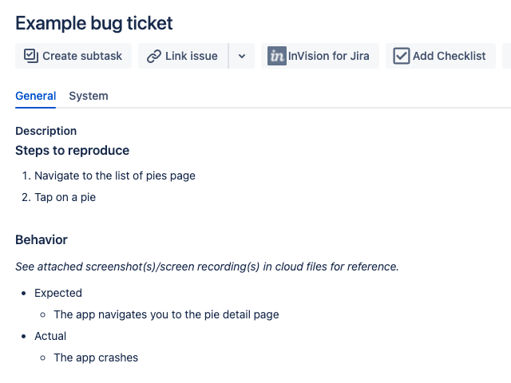
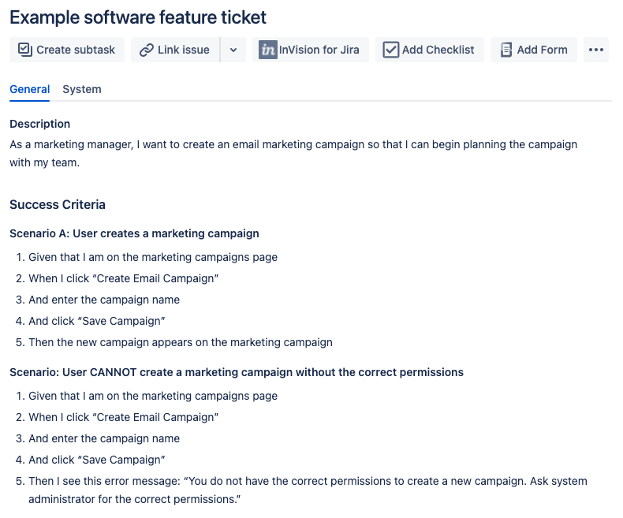

# 📑 Document Templates

Document templates for software engineers.

## [Jira Bug Ticket](./jira-bug-ticket.txt)

A template detailing a software bug in Jira.

> 

## [Jira Software Feature Ticket](./jira-software-feature-ticket.txt)

A template for detailing a software engineering feature in Jira. Success criteria written following the Gherkin framework. See [Writing User Stories With Gherkin](https://medium.com/@nic/writing-user-stories-with-gherkin-dda63461b1d2) for more info.

> 

## [Technology Proposal](./technology-proposal.txt)

A template to propose new technology purchases or adoptions.
